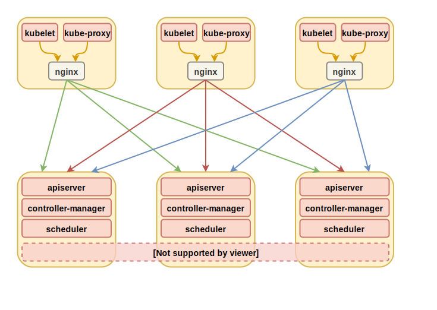

# kubei

`kubei` (Kubernetes installer) 是一个go开发的用来部署Kubernetes高可用集群的命令行工具，该工具可在`Windows`、`Linux`、`Mac`中运行

`kubei`原理：通过ssh连接到集群服务器，进行容器引擎安装、kubernetes组件安装、主机初始化配置、本地负载均衡器部署、调用kubeadm初始化集群master、调用kubeadm将主机加入节点

提供离线部署功能，自定义证书过期时间

支持使用普通用户（sudo用户）连接集群服务器进行安装部署，支持通过堡垒机连接集群服务器  

# 版本支持

<table>
    <thead>
        <tr>
            <th align="center" colspan="2">应用/系统</th>
            <th align="center">版本</thalign="center">
        </tr>
    </thead>
    <tbody>
        <tr>
            <td align="center" colspan="2">Kubernetes</td>
            <td align="center">1.16.X、1.17.X、1.18.X</td>
        </tr>
        <tr>
            <td align="center">容器引擎</td>
            <td align="center">目前只支持Docker</td>
            <td align="center">18.09.X、19.XX.XX</td>
        </tr>
        <tr>
            <td align="center">网络插件</td>
            <td align="center">目前只支持flannel</td>
            <td align="center">0.11.0</td>
        </tr>
        <tr>
            <td align="center" colspan="2">系统</td>
            <td align="center">Ubuntu16.04+、CentOS7.4+</td>
        </tr>
    </tbody>
</table>


*etcd版本由kubeadm对于版本默认确定*



# 快速开始

|   主机    | 集群角色 |      系统版本      |
| :-------: | :------: | :----------------: |
| 10.3.0.10 |  master  | Ubuntu 18.04 LTS   |
| 10.3.0.11 |  master  | Ubuntu 18.04 LTS   |
| 10.3.0.12 |  master  | Ubuntu 18.04 LTS   |
| 10.3.0.20 |  worker  | Ubuntu 18.04 LTS   |
| 10.3.0.21 |  worker  | Ubuntu 18.04 LTS   |

*默认使用root用户和22端口，如果需要使用普通用户和其它ssh端口，请查看[ssh用户参数说明](./docs/flags.md)*

*如果要用密码做ssh登录验证，请查看[ssh用户参数说明](./docs/flags.md)*

**下载离线包：**

https://github.com/yuyicai/kubernetes-offline/releases

下载部署程序

https://github.com/yuyicai/kubei/releases

**执行部署命令：**

```
./kubei init --key=$HOME/.ssh/k8s.key \
 --masters 10.3.0.10,10.3.0.11,10.3.0.12 \
 --workers 10.3.0.20,10.3.0.21 \
 --offline-file ./kube_v1.17.9-docker_v18.09.9-flannel_v0.11.0-amd64.tgz \
 --skip-headers
```

部署过程及结果：

```
[10.3.0.21] [preflight] Checking SSH connection
[10.3.0.11] [preflight] Checking SSH connection
[10.3.0.10] [preflight] Checking SSH connection
[10.3.0.12] [preflight] Checking SSH connection
[10.3.0.20] [preflight] Checking SSH connection
[10.3.0.10] [send] send pkg to /tmp/.kubei/kube_v1.17.9-docker_v18.09.9-flannel_v0.11.0-amd64.tgz,
[10.3.0.21] [send] send pkg to /tmp/.kubei/kube_v1.17.9-docker_v18.09.9-flannel_v0.11.0-amd64.tgz,
[10.3.0.11] [send] send pkg to /tmp/.kubei/kube_v1.17.9-docker_v18.09.9-flannel_v0.11.0-amd64.tgz,
[10.3.0.20] [send] send pkg to /tmp/.kubei/kube_v1.17.9-docker_v18.09.9-flannel_v0.11.0-amd64.tgz,
[10.3.0.12] [send] send pkg to /tmp/.kubei/kube_v1.17.9-docker_v18.09.9-flannel_v0.11.0-amd64.tgz,
[10.3.0.10] [container-engine] Installing Docker
[10.3.0.20] [container-engine] Installing Docker
[10.3.0.21] [container-engine] Installing Docker
[10.3.0.11] [container-engine] Installing Docker
[10.3.0.12] [container-engine] Installing Docker
[10.3.0.10] [container-engine] Successfully installed Docker
[10.3.0.21] [container-engine] Successfully installed Docker
[10.3.0.11] [container-engine] Successfully installed Docker
[10.3.0.12] [container-engine] Successfully installed Docker
[10.3.0.20] [container-engine] Successfully installed Docker
[10.3.0.10] [kube] Installing Kubernetes component
[10.3.0.11] [kube] Installing Kubernetes component
[10.3.0.20] [kube] Installing Kubernetes component
[10.3.0.12] [kube] Installing Kubernetes component
[10.3.0.21] [kube] Installing Kubernetes component
[10.3.0.10] [kube] Successfully installed Kubernetes component
[10.3.0.21] [kube] Successfully installed Kubernetes component
[10.3.0.20] [kube] Successfully installed Kubernetes component
[10.3.0.12] [kube] Successfully installed Kubernetes component
[10.3.0.11] [kube] Successfully installed Kubernetes component
[10.3.0.10] [cert] Creating certificate
[10.3.0.12] [cert] Creating certificate
[10.3.0.11] [cert] Creating certificate
[10.3.0.10] [kubeadm-init] Initializing master0
[10.3.0.10] [kubeadm-init] Successfully initialized master0
[10.3.0.10] [network] Add the flannel network plugin
[10.3.0.12] [kubeadm-join] Joining master nodes
[10.3.0.21] [kubeadm-join] Joining worker nodes
[10.3.0.20] [kubeadm-join] Joining worker nodes
[10.3.0.11] [kubeadm-join] Joining master nodes
[10.3.0.12] [kubeadm-join] Successfully joined master nodes
[10.3.0.21] [kubeadm-join] Successfully joined worker nodes
[10.3.0.20] [kubeadm-join] Successfully joined worker nodes
[10.3.0.11] [kubeadm-join] Successfully joined master nodes
[10.3.0.10] [check] Waiting for all nodes to become ready. This can take up to 6m0s
NAME        STATUS   ROLES    AGE   VERSION   INTERNAL-IP   EXTERNAL-IP   OS-IMAGE             KERNEL-VERSION       CONTAINER-RUNTIME
10.3.0.10   Ready    master   56s   v1.17.9   10.3.0.10     <none>        Ubuntu 18.04.4 LTS   4.15.0-106-generic   docker://18.9.9
10.3.0.11   Ready    master   28s   v1.17.9   10.3.0.11     <none>        Ubuntu 18.04.4 LTS   4.15.0-106-generic   docker://18.9.9
10.3.0.12   Ready    master   28s   v1.17.9   10.3.0.12     <none>        Ubuntu 18.04.4 LTS   4.15.0-106-generic   docker://18.9.9
10.3.0.20   Ready    <none>   11s   v1.17.9   10.3.0.20     <none>        Ubuntu 18.04.4 LTS   4.15.0-106-generic   docker://18.9.9
10.3.0.21   Ready    <none>   11s   v1.17.9   10.3.0.21     <none>        Ubuntu 18.04.4 LTS   4.15.0-106-generic   docker://18.9.9

Kubernetes High-Availability cluster deployment completed
```


[更多安装示例](./docs/example.md)（指定安装版本，使用堡垒机连接等）

[参数说明](./docs/flags.md)


感谢：

[cobra]( https://github.com/spf13/cobra ): 应用cil框架采用cobra

[kubeadm]( https://github.com/kubernetes/kubernetes/blob/master/cmd/kubeadm/app/cmd/phases/workflow/doc.go ): 子命令工作流采用了kubeadm workflow模块，可以单独执行每一个子命令流程

[kubespray]( https://github.com/kubernetes-sigs/kubespray/blob/master/docs/ha-mode.md ): 高可用配置直接使用了kubespray项目的配置


TODO

- [ ] calico网络组件支持
- [ ] 增加节点功能
- [x] 离线部署
- [x] 自定义证书过期时间